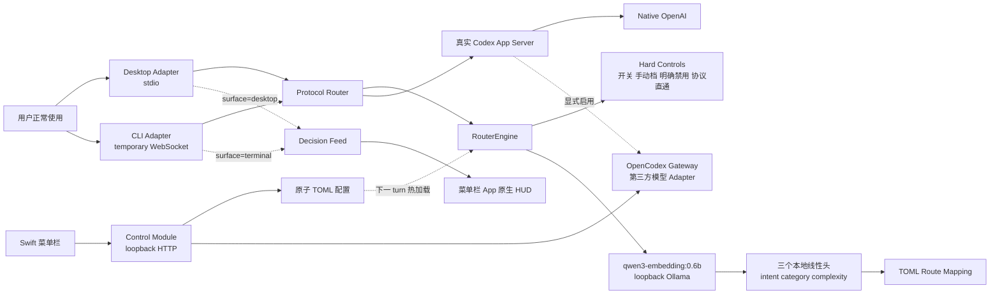

# Architecture

当前实现版本：`1.3.0`。

## 设计原则

- Transparent Proxy：用户入口、task、历史、prompt、权限和工具行为保持不变。
- Embedding Primary：正常请求的语义只由 embedding + 本地线性头判断，不再由生成式 2B 模型或加权规则主导。
- Hard Controls Only：程序化逻辑只处理不可学习的不变量，不参与普通请求的语义分类。
- Fail Open：分类器、模型产物、配置、日志和展示失败都不能阻断 Codex。
- Per Turn：长对话中的每个 `turn/start` 都可得到不同参数。
- Local Only：embedding 请求只发送到 loopback Ollama，无需额外 API key。



## Router Core

`RouterEngine` 对协议层只暴露一个主要接口：

```ts
routeTurn(params: TurnStartParams): Promise<RouteDecision>
```

内部顺序固定为：

1. Router disabled、CLI 显式模型或其他 transport bypass：原样直通。
2. 完整消息命中“升一档 / 拉满 / 恢复自动”：确定性执行，不调用分类器。
3. 明确关闭路由、空请求或内部协议上下文：原样直通。
4. `EmbeddingClassifier` 调用 loopback `/api/embed`，获得 1,024 维向量。
5. 三个 multinomial logistic-regression 线性头分别预测 `intent / category / complexity`。
6. `category Route` 与 `complexity Route` 取 `route_order` 中较强者。
7. 模型目录校验通过后，仅修改 Codex 路由字段。

没有 confidence fallback。验证集上 embedding 在每个 confidence 区间都优于旧规则；低置信度退回旧规则会降低整体准确率。分类器失败时也不执行语义猜测，而是直接 fail-open。

`RouteDecision.intent` 是独立的观测字段：`ask / do / continue / control / unknown`。它不会进入档位计算，也不会写入 prompt、additional context 或任何 agent-visible 字段；CLI、菜单栏和本地审计只展示 `[intent] [route]`。

## EmbeddingClassifier 深模块

`EmbeddingClassifier` 隐藏以下细节，`RouterEngine` 只依赖 `AiClassifier` 的 `warmup / classify` 两个方法：

- Ollama `/api/embed` 请求、loopback 限制、超时和保活；
- `collapse_whitespace_then_tail_v1` 预处理；
- embedding L2 normalization；
- 三个 JSON 线性头的 schema、类别顺序、维度、模型 digest 一致性校验；
- logits、softmax、类别和置信度计算；
- 冷启动期间的有界等待与 fail-open。

三个已验证线性头随 Router 版本发布：

```text
resources/router/classifier-v1/
├── manifest.json
├── intent.json
├── category.json
└── complexity.json
```

安装脚本将它们原子复制到：

```text
~/.agent-dock/classifier-v1/
├── intent.json
├── category.json
└── complexity.json
```

运行时文件权限为 owner-only。训练输入、embedding cache、验证预测、候选模型和报告继续留在 Git ignored 的 `tools/training/work/`；只有经过验证并明确发布的三个线性头进入 `resources/router/classifier-v1/`。

## Sticky 与硬控制

Sticky state 只保存每个 task 最近一次实际应用的 `category / complexity / routeName`，最多 256 个 task：

- 分类器返回 `PASS_CONTEXT` 时，可沿用当前 task 的 Route；
- 分类器超时或冷启动时，只有精确的续话短语可沿用已有 Route；
- 明确“不要路由”不会使用 sticky；
- “恢复自动”清除当前 task 的 sticky state。

这些行为是会话连续性和用户控制，不是普通请求的语义分类。

## 热加载

`ReloadingRouterEngine` 在每个 turn 前只比较：

- `router.toml` metadata；
- `intent.json / category.json / complexity.json` metadata。

未变化时不解析 TOML、不读取模型、不访问 Gateway、不做网络健康检查。变化时先完整解析和校验，再原子替换 `RouterEngine`；`RouterSessionState` 独立持有，因此热加载不会丢失 task 连续性。分类器配置或模型产物变化时才创建并预热新的 classifier。

## Transport 与协议不变量

Desktop 和 CLI Adapter 都把来源显式标记为 `desktop / terminal / management`，不通过进程列表猜测前台应用。同一 `threadId` 的消息保持顺序，不同 task 不会被一个慢 embedding 请求串行阻塞。

仅处理 `method === "turn/start"`，除以下字段外保持消息不变：

```text
params.model
params.effort
params.serviceTier
params.collaborationMode.settings.model
params.collaborationMode.settings.reasoning_effort
```

`params.input` 不做删除、拼接、重写或注入。其他 JSON-RPC 请求和服务端响应原样转发。

## Island 与 Control Module

Router Adapter 在本轮决策产生后立即异步写入 `src/island/` 持有的目录型 Decision Feed；菜单栏 App 通过 `GET /v1/decisions?after=...` 增量读取并显示原生 HUD，不等待 Codex 回答。Island 另有已实现、尚未接入常驻运行时的状态 Core 与 Decision Feed Input；未来仅由 M4 连接异步消费其状态快照。

Control Module 是配置写入与本机 HTTP 编排入口；Gateway Module 自己封装 OpenCodex 生命周期：

```text
GET  /v1/status
GET  /v1/decision
GET  /v1/decisions?after=:cursor&limit=:n
PUT  /v1/router/enabled
PUT  /v1/routes/:name
PUT  /v1/gateway/routed
POST /v1/gateway/dashboard
```

供应商、账号、API Key 和 provider-specific 配置属于 OpenCodex。菜单栏只通过 Dashboard seam 调用 `ocx gui`，不读取或复制 Gateway 配置。

## 生命周期和 fail-open

- Desktop：随 Codex App Server 子进程启动/退出。
- CLI：每个交互会话启动一个 Router、一个临时 loopback WebSocket 和一个 Codex App Server。
- Embedding：Router 启动时后台预热；首轮最多等待 25ms，真实冷加载仍原样直通。
- 配置：Control Module 原子替换 TOML；下一次 turn 热加载。
- Gateway：只有用户显式启用且 OpenCodex 健康时才切换。

Router Core 对 embedding、线性头、审计、展示和热加载错误均 fail-open。OpenCodex 被启用后则是真正的数据面依赖，不能承诺其崩溃时当前会话无损切回。

## 审计日志

`~/.agent-dock/events.jsonl` 是轻量决策索引，不是第二份会话记录。schema v3 只记录来源、`thread_id`、prompt hash、意图、实际 Route、Fast、原因、分类器状态和耗时。

Prompt 明文、cwd、实际 model/effort、回答和工具调用仍由 Codex 会话 JSONL 管理；category 与 complexity 不进入审计或模型上下文。1.3 新增可选的 `classifier_kind = "embedding_linear_heads"`，不改变历史事件的可读性，也不要求迁移旧 JSONL。
