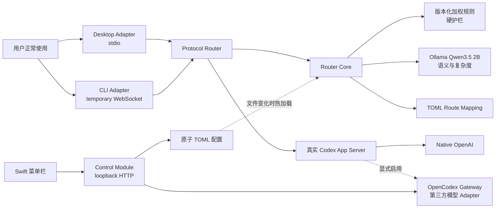

# Architecture

## 设计原则

- Transparent Proxy：用户入口、task、历史、prompt、权限和工具行为保持不变。
- Fail Open：分类、配置、日志、Ollama 失败都不能阻断 Codex。
- Hybrid Decision：确定性护栏优先，本地小模型只处理模糊部分。
- Per Turn：长对话中的每个 `turn/start` 都可得到不同参数。
- Local Only：Ollama 和 CLI 代理仅使用 loopback；无需额外 API key。



## Module 与 Interface

核心 Module 是 `RouterEngine`，对外只有一个主要 Interface：

```ts
routeTurn(params: TurnStartParams): Promise<RouteDecision>
```

它隐藏规则评分、Ollama 超时、复杂度合并、task sticky state、模型目录校验和审计。协议 Adapter 不理解业务分类，只消费 `RouteDecision`。

`ReloadingRouterEngine` 是 Router Core 前的配置 Adapter。每个 turn 只做本地文件 metadata 比较；文件未变化时不解析 TOML、不访问 Gateway、不进行网络健康检查。文件变化时先完整解析和校验，再替换当前 `RouterEngine`；失败由 `ProtocolRouter` 原样直通。

菜单栏的 Control Module 是另一条独立 Interface：

```text
GET  /v1/status
PUT  /v1/router/enabled
PUT  /v1/routes/:name
PUT  /v1/gateway/routed
POST /v1/gateway/dashboard
```

它是配置写入和 Gateway 生命周期的唯一 owner。`LocalOpenCodexGatewayAdapter` 负责 OpenCodex 健康检查、模型发现、`ocx restore / restore back` 和 Dashboard 唤起；这些操作不会进入 Router Core 的 per-turn Interface。

`GET /v1/status` 的 Gateway snapshot 同时保留兼容用的模型 ID 数组，并提供标准化 `modelCatalog`：provider、是否依赖 Gateway、支持的 reasoning effort、默认 effort 与 service tier。Control Module 在写入 Route 前再次校验这些能力；Swift UI 只负责展示和选择，不维护 provider-specific 能力表。

供应商、账号、密钥和 provider-specific 配置不属于 Router Module。菜单栏只跨过 Dashboard Seam 调用 `ocx gui`，不读取或复制 OpenCodex 的 provider schema。因为上游命令在冷启动时会顺带注入 Codex，Adapter 会保存并恢复调用前的 routed 状态，使“配置 Gateway”与“启用 Gateway”保持正交。

两个外部 Seam：

- Desktop Seam：`CODEX_CLI_PATH` -> `codex-router ... app-server ...` -> bundled Codex stdio。
- CLI Seam：`~/.local/bin/codex` -> 临时 loopback WebSocket -> system Codex App Server stdio。

## 决策优先级

1. Router disabled、CLI 显式模型、本地 provider 或显式 remote：直通。
2. 明确关闭 Router：直通，且不使用 sticky route。
3. Router/Hook/Agent 双信号硬规则：`AGENT_WORKFLOW`。
4. 版本化加权规则集。
5. Qwen 输出；只有规则 abstain 时才允许它决定 category。
6. 确定性复杂度与 Qwen 复杂度合并。Qwen 只能上调一级，不能单独选择 `extreme/max`。
7. category Route 和 complexity Route 取配置顺序中较强者。
8. 服务端模型目录不支持该 model/effort 时直通。

## 协议不变量

仅处理 `method === "turn/start"` 的 JSONL / WebSocket text message。除以下字段外保持消息不变：

```text
params.model
params.effort
params.serviceTier
params.collaborationMode.settings.model
params.collaborationMode.settings.reasoning_effort
```

`params.input` 不做删除、拼接、重写或注入。其他 JSON-RPC 请求和服务端响应原样转发。

## 生命周期

- Desktop：随 Desktop 的 App Server 子进程启动/退出。
- CLI：每个交互会话启动一个 Router、一个本机临时 WS listener 和一个 App Server；会话退出全部回收。
- Ollama：Homebrew service 共享；Router 启动时后台预热，保活 30 分钟。
- 首次冷启动：不让首轮排队等待模型，直接使用规则结果；预热完成后后续 turn 启用 AI。
- 配置：Control Module 原子替换 TOML；运行中的 Router 在下一次 turn 热加载。
- Gateway：默认保持原生 Codex。只有用户显式启用且 OpenCodex 健康时才切换；Gateway 配置变化需要重开 Codex 会话。

## Fail-open 的边界

Router Core 对规则、Ollama、审计和热加载错误均 fail-open，原始 JSON-RPC 消息会字节级直通。Control Module 离线也不影响数据面。

OpenCodex 被启用后位于 Codex 与上游 provider 之间，属于真正的数据面依赖，因此不能承诺 Gateway 崩溃时当前会话完全无感。当前 Interface 通过启用前健康检查、状态轮询和显式“恢复原生”降低风险，但不把这个风险伪装成 Router fail-open。

## 审计日志

`~/.codex/router/events.jsonl` 是全局 Router 的轻量决策索引，不是第二份会话记录。它通过 `thread_id + prompt_hash + timestamp` 与 Codex 的完整会话 JSONL 关联，只记录路由类别、Route、Fast、原因和耗时。

Prompt 明文、cwd、实际 model/effort、回答和工具调用均只保留在 Codex 会话 JSONL。规则冲突或 fail-open 时，Router 额外记录候选类别、margin 和 AI 状态，便于定位超时或误分类。

日志单文件最大 30MB，超过后将当前文件滚动为 `events.jsonl.1`，只保留这一份历史备份。
