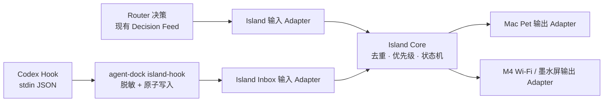
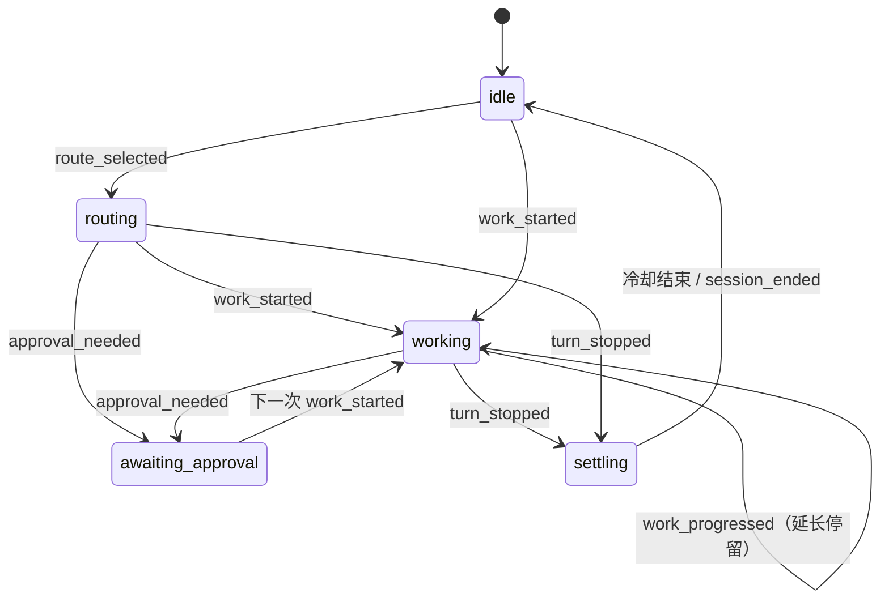

# Island 实现方案：把 Codex 生命周期安全地变成宠物 / 墨水屏状态

> 状态：设计已确认，**尚未实现新的 Hook、状态机或设备输出**。本文件是下一阶段的实现合同；现有
> `src/island/decision-feed.ts` 保持原样。
>
> M4 插件版系统的本地调研、两阶段路线和实机到手前的停止点见
> [M4X-PLUGIN-INTEGRATION.md](./M4X-PLUGIN-INTEGRATION.md)。

## 先说结论

可以用 Hook 触发 Island，但 Hook 不应直接控制宠物、更不应直接刷新墨水屏。

Hook 的职责只有一件事：把 Codex 的一个**经过脱敏的生命周期信号**交给 Island。Island 再把多个
输入合并成稳定状态，最后由 Mac Pet 或未来 M4 的输出 Adapter 显示。这样 Router、Codex 和设备
都不会互相等待，也不会因为一次工具调用就让宠物做一次重动作。



因此，`src/island/` 是一个完整的第三功能 Module；Pet 和墨水屏都只是它的输出，不新建
`src/pet/` 顶层目录。

## Hook 到底触发什么？

第一版只使用对角色状态真正有意义的事件。Hook 的命令从 stdin 读取 Codex JSON，写入本机 Island
Inbox 后立即退出 `0`、不输出任何内容；它不能改变 Codex 的继续、权限或上下文。

| Codex 事件 | 产生的 Island 信号 | Island 目标状态 | 第一版是否启用 | 原因 |
| --- | --- | --- | --- | --- |
| `SessionStart` | `session_started` | `idle` → 短暂唤醒 | 是 | 表示一次会话可用，不需要动画反复播放。 |
| Router 完成决策（现有 Feed） | `route_selected` | `routing` 或更新小标识 | 是 | 保留当前 `[intent] [route]` 信息，但低优先级。 |
| `PreToolUse` | `work_started` | `working` | 是，仅匹配写入/执行类工具 | 是“开始做事”的可靠边缘，不能匹配全部工具。 |
| `PostToolUse` | `work_progressed` | 维持 `working` | 是，与上行成对 | 只延长工作状态，不触发新动作。 |
| `PermissionRequest` | `approval_needed` | `awaiting_approval` | 是 | 比工作状态优先级高，适合静态提示或轻提示。 |
| `Stop` | `turn_stopped` | `settling` → `idle` | 是 | 只表示本回合停止，**不等同于任务成功**。 |
| `SessionEnd` | `session_ended` | `idle` | 后续可启用 | 用于收尾；该 Hook 的时间限制很短。 |
| `SubagentStart` / `SubagentStop` | `collaboration_changed` | `working` | 第二版 | 有价值，但第一版不增加复杂度。 |
| Codex App Server 的 `requestUserInput` | `user_input_needed` | `awaiting_approval` | 后续，不是 Hook | 能表达“需要你回到 Mac 回答”，但先不扩大第一版输入面。 |
| `UserPromptSubmit` | — | — | 不启用 | 事件带原始 `prompt`；本项目不需要它来表达“开始工作”。 |
| `PreCompact` / `PostCompact` | — | — | 不启用 | 对宠物状态没有足够展示价值。 |

`PreToolUse` / `PostToolUse` 的匹配应先限制为 `Bash|apply_patch`（或 Codex 兼容别名
`Edit|Write`）。读取、列目录、浏览等高频工具不进入第一版，否则会重现鼠标悬浮时那种频繁、沉重的
动作加载。

## 哪些数据可以传，哪些绝不传

Hook 输入中会出现 `prompt`、`transcript_path`、`cwd`、`tool_input`、`tool_response` 等字段，但 Island
不需要它们。尤其 `transcript_path` 不是稳定 Hook 接口，不能把读取会话正文作为实现依赖。

Island 的最小事件合同建议为：

```ts
type IslandEvent = {
  schemaVersion: 1;
  id: string;
  occurredAt: string;
  source: "router" | "codex-hook";
  kind:
    | "route_selected"
    | "session_started"
    | "work_started"
    | "work_progressed"
    | "approval_needed"
    | "turn_stopped"
    | "session_ended";
  sessionIdHash?: string;
  turnIdHash?: string;
  toolClass?: "shell" | "write" | "mcp";
  surface?: "desktop" | "terminal" | "management";
  intent?: "ask" | "do" | "continue" | "control" | "unknown";
  route?: string;
};
```

允许保留的是时间、匿名化会话 / 回合标识、有限的工具类别，以及已有的本地路由展示字段。以下内容
**绝不写入 Island Inbox、状态快照、Pet、设备网络包或日志**：prompt 正文、回答正文、命令内容、
工具输入 / 输出、cwd、文件路径、会话 transcript、模型回复和密钥。

## 让宠物保持安静的状态机

Island 不把“每个事件”映射为“每个动画”。它只在状态发生实质变化时发布快照。



状态优先级固定为：`awaiting_approval` > `working` > `routing` > `settling` > `idle`。建议的第一版
参数是：

- 同一会话、同一种信号在 1.5 秒内去重；`PostToolUse` 只刷新工作停留时间。
- `working` 至少停留 1.5 秒，`settling` 约 1 秒；避免工具很快完成时出现闪烁。
- 输出 Adapter 只接收状态变化后的 `IslandSnapshot`，并且最多每 300–500ms 推送一次 Mac UI。
- Mac Pet 的 hover 只显示信息或一次轻反馈，**不重新请求重动画资源**；`working` 使用循环极轻的 idle 变体。
- 墨水屏仅在可见状态确实变化且超过设备刷新冷却期后更新。初始建议不高于每 15 秒一次；设备到手后按
  实测刷新模式再校准。

这些是产品设计建议，不是 Codex 或 CodeIsland 的既定行为；目的是直接解决当前宠物“动作加载太频繁”的
问题。

## 建议的目录与 Interface

不在第一版创建多个产品文件夹；所有 Island 实现在一个 Module 中按内部职责分层：

```text
src/island/
  decision-feed.ts                  # 已实现：Router 的只读事件流
  core/
    types.ts                         # IslandEvent / IslandSnapshot
    reducer.ts                       # 纯状态归约器
    scheduler.ts                     # 去重、最短停留、刷新冷却
  inputs/
    decision-feed-input.ts           # 现有 Router Feed → IslandEvent
    hook-inbox.ts                    # Hook Inbox → IslandEvent
  outputs/
    mac-pet-output.ts                # 后续：本机 Pet
    eink-output.ts                   # 后续：M4 Wi-Fi / 墨水屏

src/app/cli/
  run-island-hook.ts                 # 命令入口：stdin 脱敏后写入 Inbox
```

Island Core 对外只暴露两个深接口：

```ts
accept(event: IslandEvent): Promise<void>;
snapshot(): IslandSnapshot;
```

每个输出 Adapter 只实现 `publish(snapshot)`。它不能读 Codex Hook、不能改 Router 配置，也不能让 Router
等待设备响应。

## 为什么第一版用 Inbox，而不是 Hook 直接连设备

Codex 当前实际运行的 Hook 是同步 command Hook；多个同事件 Hook 还会并发启动。让每个 Hook 直接访问
UI、Socket 或 Wi-Fi 会带来竞争、超时和错误传播风险。

第一版采用与现有 `decision-feed.ts` 一致的 owner-only 原子目录队列：

```text
Codex Hook command
  → ~/.agent-dock/island-inbox/<time>-<uuid>.json  (0600)
  → Island 输入循环读取、校验、归约
  → 输出 Adapter
```

命令必须有很短的超时（建议 1 秒），始终 fail-open；写入失败时照常退出 `0`。这保证宠物、Control 进程或
墨水屏断开都不会影响 Codex 的工具调用。以后确有低延迟需求时，Inbox 可以被 Unix Socket Adapter 替换，
但 `IslandEvent` 与 `Island Core` Interface 不变。

Hook 配置应是用户显式安装的 `~/.codex/hooks.json` 或 Agent Dock 插件，不自动覆盖用户现有 Hook。安装后
由你在 Codex 的 `/hooks` 中审阅并信任确切命令；这也是 Codex 的安全模型。

## CodeIsland 能借鉴什么，不能直接抄什么

已直接阅读并锁定 [wxtsky/CodeIsland 的 v1.0.31 源码提交
`9e3a1eb`](https://github.com/wxtsky/CodeIsland/tree/9e3a1eb1844f0b8bf05193228a6ffa41a013dec2)。以下是确认
事实与对 Agent Dock 的取舍：

| CodeIsland 已实现的机制（确认事实） | 对 Agent Dock 的结论 |
| --- | --- |
| [`ConfigInstaller.swift`](https://github.com/wxtsky/CodeIsland/blob/9e3a1eb1844f0b8bf05193228a6ffa41a013dec2/Sources/CodeIsland/ConfigInstaller.swift#L268-L288) 安装 Codex 的 `SessionStart`、`SessionEnd`、`UserPromptSubmit`、`PreToolUse`、`PostToolUse`、`PermissionRequest`、`Stop` Hook。 | 借鉴“Hook → 本地桥”的输入边界；但 Agent Dock 不自动改写 `~/.codex/hooks.json`，且第一版不订阅 `UserPromptSubmit`。 |
| [`CodeIslandBridge/main.swift`](https://github.com/wxtsky/CodeIsland/blob/9e3a1eb1844f0b8bf05193228a6ffa41a013dec2/Sources/CodeIslandBridge/main.swift#L203-L240) 把 stdin JSON 补足来源 / session / TTY 元数据后发往 Unix Socket。 | 借鉴“轻量桥接命令”理念；第一版先采用原子 Inbox，避免常驻 Socket 生命周期耦合。 |
| [`HookServer.swift`](https://github.com/wxtsky/CodeIsland/blob/9e3a1eb1844f0b8bf05193228a6ffa41a013dec2/Sources/CodeIsland/HookServer.swift#L447-L583) 用 owner-only Unix listener、载荷上限、解析、过滤与路由来隔离 Hook。 | 第二版若需实时性，可把它作为 `inputs/` 的替代实现；保留同一 `IslandEvent` 合同。 |
| [`SessionSnapshot.swift`](https://github.com/wxtsky/CodeIsland/blob/9e3a1eb1844f0b8bf05193228a6ffa41a013dec2/Sources/CodeIslandCore/SessionSnapshot.swift#L776-L888) 用纯 reducer 将提示、工具前后、停止归约为角色状态；`AppState.swift` 对权限 / 问题进入等待状态。 | 直接借鉴“纯 reducer + 明确优先级”，但采用更少、更隐私安全的事件。 |
| [`AppState+CodexAppServer.swift`](https://github.com/wxtsky/CodeIsland/blob/9e3a1eb1844f0b8bf05193228a6ffa41a013dec2/Sources/CodeIsland/AppState%2BCodexAppServer.swift#L67-L166) 与 [`AppState+TranscriptTailer.swift`](https://github.com/wxtsky/CodeIsland/blob/9e3a1eb1844f0b8bf05193228a6ffa41a013dec2/Sources/CodeIsland/AppState%2BTranscriptTailer.swift) 处理桌面恢复。 | 不把 transcript 当 Hook API；Agent Dock 已有 Router Feed，恢复需求在后续单独设计。 |
| [`ESP32Protocol.swift`](https://github.com/wxtsky/CodeIsland/blob/9e3a1eb1844f0b8bf05193228a6ffa41a013dec2/Sources/CodeIslandCore/ESP32Protocol.swift) 和 `hardware/hardware.ino` 面向它自带的 Waveshare ESP32-C6 LCD Buddy、私有 BLE UUID 与小帧协议。 | **不能直接复用。** M4 是不同设备与协议；只借鉴“状态发布 / 心跳 / 输出 Adapter”分层。 |

CodeIsland 使用更多事件、更多桌面恢复路径和一套特定 ESP32 设备协议；它是很好的架构参照，不是本项目的
可复制依赖。Agent Dock 的优势是已有 Router Decision Feed，因此 Island 可以从小、稳定、脱敏的事件模型
开始。

它的 Mascot 时间线最低间隔约为 0.05 秒（约 20 FPS），并通过动画 gate 在隐藏或休眠时停止；这适合 Mac
面板，不适合直接作为本项目宠物的交互策略。Agent Dock 只借鉴其状态归约，保留前述低频状态输出策略。
参考 [`MascotTimeline.swift`](https://github.com/wxtsky/CodeIsland/blob/9e3a1eb1844f0b8bf05193228a6ffa41a013dec2/Sources/CodeIsland/MascotTimeline.swift)
和 [`MascotAnimationGate.swift`](https://github.com/wxtsky/CodeIsland/blob/9e3a1eb1844f0b8bf05193228a6ffa41a013dec2/Sources/CodeIsland/MascotAnimationGate.swift)。

## 推荐实施顺序

1. 增加 `IslandEvent`、Inbox 和纯 reducer 的单元测试；暂时仅用日志 / Mock 输出验证状态。
2. 让现有 Decision Feed 接入 reducer，确认路由提示不会造成动画抖动。
3. 增加 `agent-dock island-hook` 命令和一份**可选** Hook 配置样例；在 `/hooks` 审阅后启用。
4. 接入 Mac Pet 输出；先做低频状态显示，再决定是否需要角色动画。
5. M4 到手后确认实际系统、局域网 API、刷新模式和待机策略，再实现 `eink-output.ts`。不要假设其能兼容
   CodeIsland 的 ESP32 BLE 协议。

## 依据与边界

- Codex Hook 的事件、匹配、stdin 字段、信任机制和 command Hook 限制，以官方
  [Hooks 文档](https://learn.chatgpt.com/docs/hooks.md) 为准。
- CodeIsland 的结论以上表锁定的源码提交为准；它说明可借鉴的实现模式，不代表 M4 的硬件能力。
- M4 的协议、刷新能力和可安装应用方式在设备到手前尚未验证，因此本文件只定义与设备无关的
  `IslandSnapshot` / Output Adapter 边界，不承诺具体连接方式。
