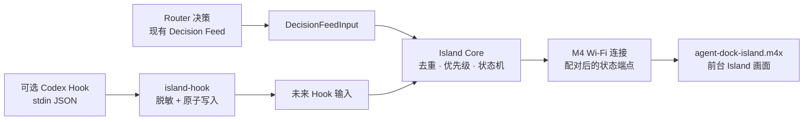
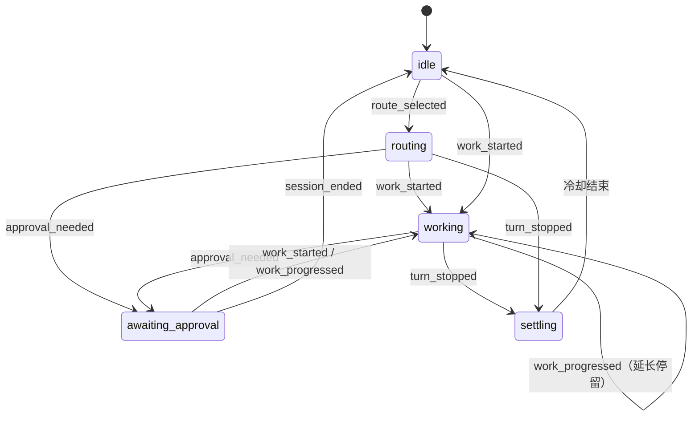

# Island 实现方案：把 Agent 状态安全地连接到 M4 墨水屏

> 状态：`IslandEngine`、状态归约 / 去重 / 停留调度，以及 Router Decision Feed 输入已实现并有单元测试。
> 它们尚未接入常驻运行时；Codex Hook 输入、M4 配对端点和 `agent-dock-island.m4x` 都尚未实现。
>
> M4 插件版系统的本地调研、两阶段路线和实机到手前的停止点见
> [M4X-PLUGIN-INTEGRATION.md](./M4X-PLUGIN-INTEGRATION.md)。

## 结论与边界

Island 的唯一产品目标是：把 Router 或未来 Codex Hook 产生的**脱敏状态**，稳定地显示在 M4 墨水屏上。
它不创建、不渲染，也不控制任何本地 Mac / Codex 宠物。现有 macOS 菜单栏图标只是应用图标，不是
Island 的显示目标。

Hook（若后续启用）不直接控制设备，也不直接触发电子纸刷新；它只提交一个内容安全的生命周期信号。
Island Core 将多个输入收敛为稳定快照，M4 连接再把该快照提供给设备。这样 Router、Codex 和设备不会
相互等待，设备离线也不会影响正常工作。



第一版选择 Wi-Fi 拉取，而不是 BLE：本机样本已证明 M4X 插件可以连接已保存的 Wi-Fi 并发出 HTTP
请求；没有证明插件层可用的 BLE Interface。设备到手后才验证网络、刷新和续航参数，不预设具体轮询
间隔。

## 已实现的 Island Core

当前代码位于 `src/island/`：

```text
src/island/
  decision-feed.ts                  # 已实现：Router 决策的有界只读事件流
  core/
    types.ts                         # IslandEvent / IslandSnapshot
    reducer.ts                       # 纯状态归约器与状态优先级
    scheduler.ts                     # 去重后的停留、过期与冷却时序
    engine.ts                        # 小的公开 Interface
  inputs/
    decision-feed-input.ts           # 已实现：Decision Feed → IslandEvent
  m4x/                               # 设备到手后新增：M4 Wi-Fi 连接与插件交付
```

`DecisionFeedInput` 只保留路由展示需要的字段，并对 `threadId` 做不可逆哈希；读取失败时返回最近快照，
不会影响 Router。它目前只在单元测试中被实例化，尚未被 `src/index.ts` 或常驻进程启动。

Island Core 的公开 Interface 与实际代码一致：

```ts
accept(event: IslandEvent): IslandSnapshot;
snapshot(): IslandSnapshot;
```

调用方只能提交事件或读取稳定快照。事件顺序、重复信号、最短可见时间和状态过期都留在 Core 内部；未来
M4 连接只读取 `IslandSnapshot`，不能反向影响 Router 或 Codex。

## 状态、节流与电子纸刷新

`IslandEvent` 不含 prompt、回答、命令、路径、cwd、transcript 或工具输入 / 输出。可传递的仅是时间、
匿名化会话 / 回合标识、有限工具类别、表面来源、路由意图和路由名。

当前状态机为：



优先级固定为：`awaiting_approval` > `working` > `routing` > `settling` > `idle`。当前默认调度参数是：

- 相同信号在 1.5 秒内合并；重复的工作信号只延长工作状态，不产生新修订号。
- `working` 至少显示 1.5 秒，最长空闲 60 秒后回到 `idle`。
- `routing` 和 `settling` 分别保持 1 秒后回到 `idle`。
- M4 端随后还应只在快照修订号改变、且实测刷新冷却已满足时刷新电子纸；冷却值必须由实机测量确定。

这会避免高频事件造成连续重绘，而不是依赖本地动画或鼠标悬浮行为。

## 未来可选的 Hook 输入

只有 Router Feed 无法表达的状态才需要 Hook，例如“工具开始工作”或“需要用户审批”。届时新增显式安装的
`agent-dock island-hook` 命令：从 Codex stdin 读取 JSON，丢弃敏感字段，写入 owner-only 的本地 Inbox，
然后立即退出。Island 运行时异步读取 Inbox 并调用 `IslandEngine.accept()`。

第一版候选映射如下；这是一份待实现的合同，不代表现在已经安装 Hook：

| Codex 事件 | Island 信号 | 目标状态 | 取舍 |
| --- | --- | --- | --- |
| `SessionStart` | `session_started` | `idle` | 只记录会话开始，不强制刷新设备。 |
| Router Decision Feed | `route_selected` | `routing` | 已有输入实现。 |
| `PreToolUse` | `work_started` | `working` | 仅匹配写入 / 执行类工具。 |
| `PostToolUse` | `work_progressed` | `working` | 仅延长工作状态。 |
| `PermissionRequest` | `approval_needed` | `awaiting_approval` | 优先级最高，适合静态提示。 |
| `Stop` | `turn_stopped` | `settling` | 不表示任务成功。 |
| `SessionEnd` | `session_ended` | `idle` | 立即收尾。 |

`UserPromptSubmit` 不纳入计划，因为它可能携带原始 prompt；读取、列目录和浏览等高频工具也不纳入，避免
制造无意义的状态切换。Hook 写入失败必须 fail-open：照常退出 `0`，绝不阻塞 Codex 工具调用。

## M4 连接的实现边界

设备到手并验证 CrossPoint / M4X Runtime 后，新增一个 M4 专用连接，而不是抽象出面向未知设备的通用
输出层：

```text
Island Core 的 IslandSnapshot
  → 配对后的局域网状态端点（Mac）
  → M4X 插件主动 GET，携带配对 Token
  → 小型 DeviceSnapshot
  → 仅在内容变化时刷新 M4 电子纸
```

该连接负责配对 Token、设备离线、缓存、过期和 M4 端刷新冷却。它必须是单独、显式启用的局域网服务；
不能把现有仅绑定 `127.0.0.1` 的 Control Module 直接暴露到局域网。设备网络包只能包含展示状态，例如
`state`、`changedAt`、`expiresAt`、`route` 和 `intent`，不含任何会话正文或密钥。

## 从 CodeIsland 借鉴的边界

已阅读并锁定 [wxtsky/CodeIsland v1.0.31 的源码提交
`9e3a1eb`](https://github.com/wxtsky/CodeIsland/tree/9e3a1eb1844f0b8bf05193228a6ffa41a013dec2)。可借鉴和
不应复用的部分如下：

| CodeIsland 已实现机制 | Agent Dock 的取舍 |
| --- | --- |
| Codex Hook → 本地桥 | 借鉴输入边界；不自动改写用户的 Hook 配置，也不订阅 `UserPromptSubmit`。 |
| Unix Socket、载荷上限和解析过滤 | 若 Inbox 的实时性不足，才作为 Hook 输入的替代实现。 |
| 纯 reducer、权限优先级和状态归约 | 已用于 Island Core；Agent Dock 保留更小、内容安全的事件合同。 |
| transcript 恢复 | 不作为 Hook 依赖；不读取会话正文。 |
| Waveshare ESP32-C6 的私有 BLE UUID 与帧协议 | 不能复用。M4 / M4X 是不同设备；第一版按 Wi-Fi HTTP 拉取设计。 |

## 推荐实施顺序

1. [x] 建立 Island Core、状态快照、去重、最短停留与 Router Decision Feed 输入，并添加单元测试。
2. [ ] M4 到手后验证 CP / M4X Runtime、恢复路径、前台生命周期、Wi-Fi 和电子纸刷新行为。
3. [ ] 制作 `agent-dock-island.m4x`，并在 Mac 上实现显式配对的 M4 Wi-Fi 状态端点。
4. [ ] 仅在 Router Feed 不足以表达所需状态时，再增加可选 Codex Hook Inbox 输入。

第 2–4 步都不能让 M4、网络或 Hook 故障进入 Router 的同步数据路径。

## 依据与限制

- M4X 插件能力和固件安装证据来自仓库根目录用户提供的只读目录
  `crosspoint插件版支持微信读书/`；详见 [M4X-PLUGIN-INTEGRATION.md](./M4X-PLUGIN-INTEGRATION.md)。
- CodeIsland 说明可借鉴的状态处理方式，不证明 M4 的协议或硬件能力。
- M4 的系统兼容性、安装、网络协议、刷新策略和续航都必须在设备到手后验证；在此之前不刷机、不写设备端
  文件，也不承诺具体实现参数。
