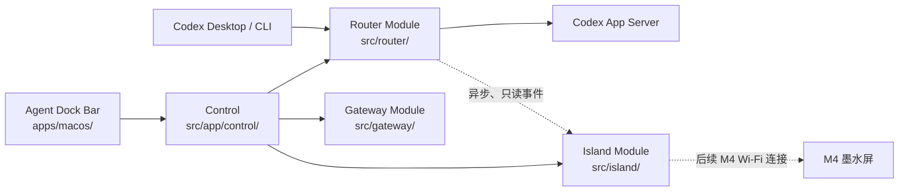

# Agent Dock 模块结构与后续演进

> 状态：**Router、Gateway、Island 的物理目录整理，以及 Island Core / Router Feed Input 已提交并推送；没有改变既有 Router 与 Gateway 运行行为。**
>
> 本文记录现在的仓库结构与后续 Island 演进。已实现的运行合同仍以
> [ARCHITECTURE.md](./ARCHITECTURE.md) 为准。
>
> Island 的 Hook 输入、状态机、隐私边界与 M4 连接方案见
> [ISLAND-IMPLEMENTATION.md](./ISLAND-IMPLEMENTATION.md)。
> M4 的 M4X 插件路线与设备到手前验证项见
> [M4X-PLUGIN-INTEGRATION.md](./M4X-PLUGIN-INTEGRATION.md)。

## 结论

面向产品能力，Agent Dock 只有三个顶层 **Module**，每项能力各占一个顶层目录：

1. `src/router/`：为 Codex Desktop / CLI 的每个回合选择路由参数。
2. `src/gateway/`：管理 OpenCodex Gateway 的状态、切换与模型能力。
3. `src/island/`：中转 Agent 的只读事件，并在后续将已收敛状态连接到 M4 墨水屏。

这里的 **Island（中转岛）不是 Pet**。它不创建也不控制本地 Mac / Codex 宠物；它只负责事件输入、
状态收敛、去重/限流，以及未来与 M4 的设备连接。因此不会创建独立的 `src/pet/` 顶层 Module。

`src/app/` 与 `src/index.ts` 是共用的本机编排和入口；它们不承载第四项产品
能力。



## 当前仓库结构

```text
apps/
  macos/AgentDockBar/             # 共用 macOS 菜单栏 App Shell
bin/                              # npm 可执行入口
docs/                             # 运行合同、策略、回滚与本文件
resources/
  router/                         # Router 默认配置与发布分类头
scripts/
  local/                          # 本机安装脚本
  macos/                          # App bundle 与图标构建脚本
src/
  router/                         # 功能 1：Router
    core/                         # 分类、配置、审计、热加载、路由判断
    adapters/                     # Desktop stdio、CLI WebSocket、Codex 协议/进程
  gateway/                        # 功能 2：Gateway
  island/                         # 功能 3：Island；当前有 Feed、Core 与 Feed Input
  app/                            # 共用 composition / 入口层，不是产品能力 Module
    control/                      # 本机 Control Interface 与配置写入
    cli/                          # 共用命令入口
  index.ts                        # composition root
test/
  router/ gateway/ island/ app/ integration/
tools/
  training/                       # 离线训练与验证工具；work/ Git ignored
```

根目录中的 `apps/`、`resources/`、`scripts/`、`test/`、`tools/` 只按运行位置和用途分类；
产品能力的归属始终以 `src/router/`、`src/gateway/`、`src/island/` 为准。

## 当前三个 Module

### Router Module — `src/router/`

Router 对调用者的主 **Interface** 是：

```ts
routeTurn(params: TurnStartParams): Promise<RouteDecision>
```

`core/` 和 `adapters/` 是同一个 Module 内的 Implementation 分层，不是两项能力：

- `core/` 负责路由判断、配置、分类器、审计、热加载和协议无关类型；
- `adapters/` 负责接住 Desktop / CLI 的不同协议，并只写入允许修改的路由字段。

Router 的不变量不变：不改写 prompt、权限、sandbox 或工具配置；分类、审计、Island 事件写入和
热加载失败都 fail-open。

### Gateway Module — `src/gateway/`

Gateway 封装 OpenCodex 的探测、启动、路径切换、恢复和模型能力发现。它的已有 **Interface** 为：

```ts
snapshot(config): Promise<GatewaySnapshot>
setRouted(routed, config): Promise<void>
openDashboard(config): Promise<void>
```

Gateway 不修改 Router 的路由判断；供应商、账号、密钥和 provider-specific 配置仍由 OpenCodex
持有。Gateway 未启用或故障时，不阻塞原生 Router。

### Island Module — `src/island/`

当前 Island 的 Implementation 包含目录型 Decision Feed、`IslandEngine` 状态 Core 和
`DecisionFeedInput`。Router 异步发布经过本地展示筛选的决策，Input 将其转为内容安全的
`IslandEvent`，Core 再收敛为 `IslandSnapshot`；Control 与菜单栏仍只读获取 Decision Feed。
它不读取或保存 prompt、工具历史或会话正文，也不能反向阻塞 Router。

未来 Island 在不改变 Router / Gateway Interface 的前提下扩展为：

```text
src/island/
  decision-feed.ts       # 已实现：Router 决策的只读事件中转
  core/                  # 已实现：状态机、去重、最短停留与快照
  inputs/                # 已实现：Decision Feed；后续可加入 Codex Hook
  m4x/                   # 设备到手后：M4 Wi-Fi 连接与插件交付
```

M4 是 Island 唯一计划中的设备目标：它只接收已收敛的状态快照，不直接订阅 Codex 请求，也不要求
Router 等待设备刷新。

## 共用层与失败隔离

| 位置 | 角色 | 不能承担的职责 |
| --- | --- | --- |
| `src/app/control/` | loopback HTTP Interface、配置原子写入、组合各 Module 状态 | 不重新实现 Router、Gateway 或 Island 规则 |
| `src/app/cli/`、`src/index.ts` | 命令和进程入口 | 不持有产品业务状态 |
| `apps/macos/AgentDockBar/` | 共用菜单栏 UI / HUD | 不直接读写配置、不会实现设备协议 |

- Island 异常、M4 设备离线或 Hooks 失败：Router 继续透明工作。
- Control 进程离线：Router 继续按本地配置工作；菜单栏显示离线状态。
- Gateway 只在用户显式启用且健康时进入数据路径；未选择时不影响原生 Codex。

## 后续顺序

1. [x] 整理仓库层级、`src/` 目录与测试目录；提取 Router、Gateway、Island 三个顶层 Module。
2. [x] 为 Island 增加独立状态快照、优先级、去重与最短停留；当前只消费现有 Decision Feed。
3. [ ] 设备到手后验证 CP / M4X Runtime、系统恢复和 Wi-Fi 行为，再增加 M4X 插件与配对后的 Wi-Fi 连接。
4. [ ] 仅在需要比 Router Feed 更丰富的状态时，增加显式启用的 Codex Hook Input。

第 3–4 步都不得把设备故障接入 Router 的同步数据路径。

## 已确认项

- [x] 三个功能 Module 的名字：`router`、`gateway`、`island`。
- [x] Island 只连接 M4，不创建或控制本地 Mac / Codex 宠物。
- [x] `app/control` / `app/cli` 是共用编排与入口，而非第四项功能。
- [x] 当前重命名、目录整理与 Island Core 已提交并推送；尚不包含 Hook Input、常驻接线或设备实现。
